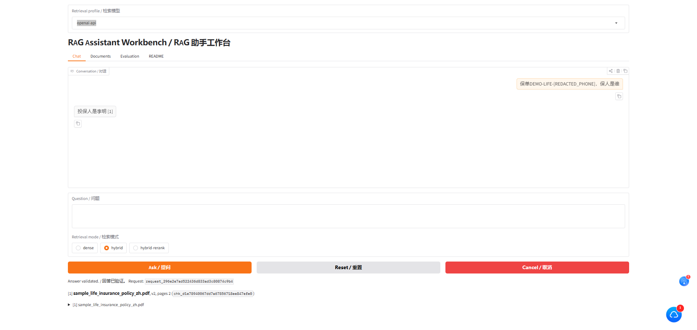
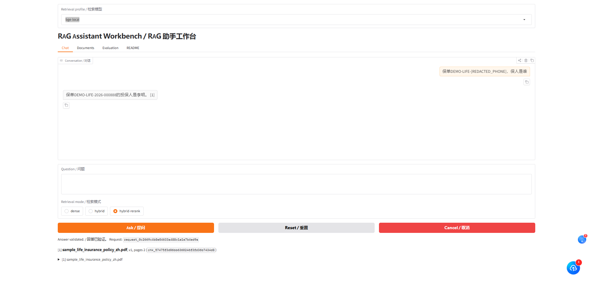
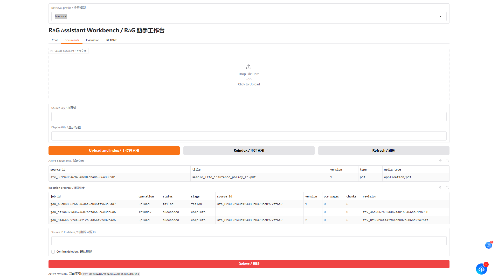
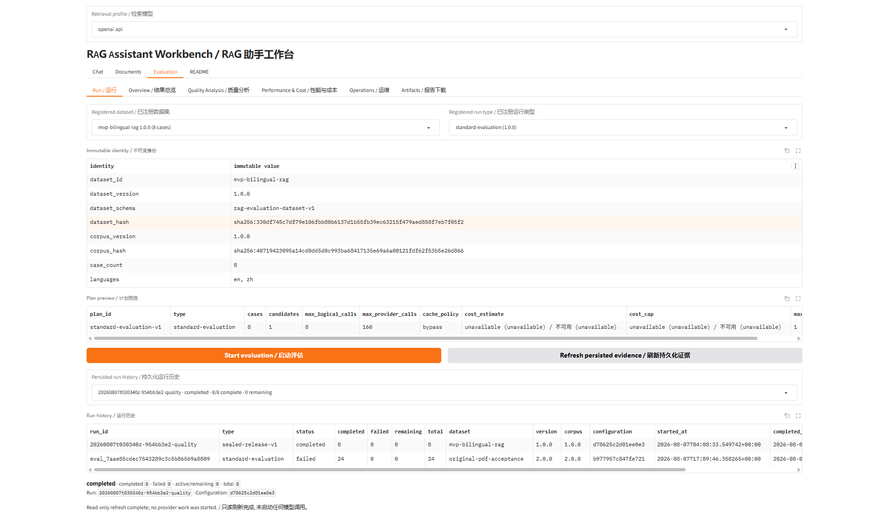
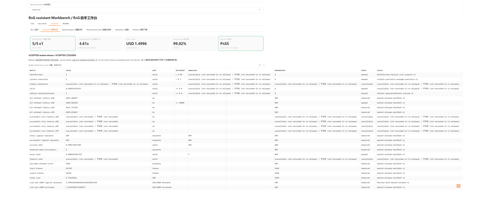
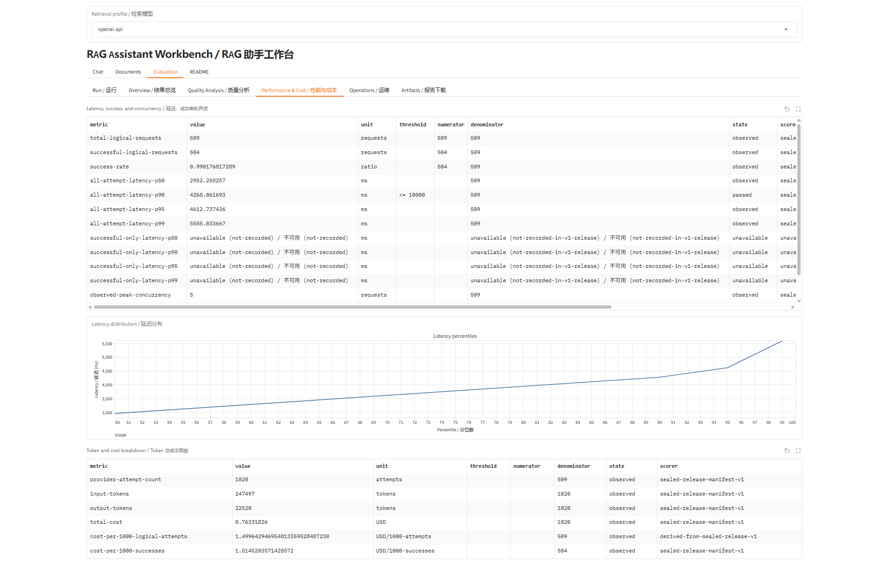
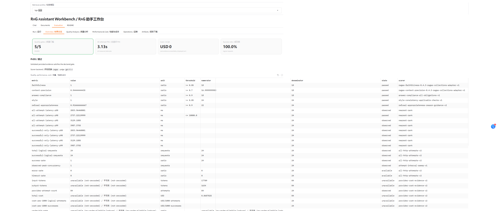

# Rag_Demo — RAG Assistant MVP

一个面向中英文知识库的证据驱动 RAG（Retrieval-Augmented Generation）应用。项目提供文档摄取、混合检索、引用式问答、评测对比、隐私保护与运行诊断，并通过 FastAPI 和 Gradio 工作台对外提供能力。

## 核心能力

- 支持 PDF、Markdown 和 UTF-8 文本文档，扫描型 PDF 可通过 Tesseract OCR 识别。
- 支持 `dense`、`hybrid`、`hybrid-rerank` 三种检索模式，使用 Chroma、BM25 和 RRF 融合。
- 使用父子分块：小块负责检索与引用，大块负责生成上下文。
- 提供 `openai-api` 与 `bge-local` 两套隔离的检索配置；BGE 使用本地嵌入和重排，答案仍由 OpenAI-compatible 模型生成。
- 对证据充分性、提示词注入、答案引用和敏感信息输出进行校验；证据不足时拒绝回答。
- 提供数据集评测、候选方案对比、HTML/JSON 报告、Prometheus 指标和 OpenTelemetry 链路。
- 摄取任务采用版本化、原子发布索引，失败任务不会替换当前可用版本。

## 技术栈

Python 3.12、FastAPI、Gradio、ChromaDB、SQLite、BM25、OpenAI-compatible API、FlagEmbedding/BGE、PyMuPDF、Tesseract、OpenTelemetry、Prometheus、pytest。

## 界面预览

### 证据引用式问答

`openai-api` 检索配置：



`bge-local` 检索配置：



### 文档摄取与索引管理



### 评测与运行证据

评测数据集、执行计划与历史运行：



OpenAI API 评测质量门禁与指标总览：



OpenAI API 延迟、吞吐、Token 与成本分析：



BGE 本地检索评测总览：



## 快速开始

### 1. 准备环境

需要安装：

- Python `3.12.x`
- [uv](https://docs.astral.sh/uv/)
- 可用的 OpenAI 或 OpenAI-compatible API
- 如需处理扫描型 PDF：Tesseract 5，以及 `chi_sim`、`eng` 语言包

### 2. 安装依赖

```powershell
uv sync
```

### 3. 配置应用

复制示例配置，并将密钥单独放入不会提交到 Git 的 `.env.local`：

```powershell
Copy-Item .env.example .env
```

```dotenv
# .env.local
RAG_MVP_OPENAI_API_KEY=replace-with-your-key
```

至少确认以下配置：

```dotenv
RAG_MVP_PROVIDER_BACKEND=openai
RAG_MVP_OPENAI_BASE_URL=https://api.openai.com/v1
RAG_MVP_EMBEDDING_MODEL=text-embedding-3-small
RAG_MVP_EMBEDDING_DIMENSION=1536
RAG_MVP_GENERATION_MODEL=gpt-4.1-mini
```

`.env` 和 `.env.local` 已在 `.gitignore` 中忽略。生产或容器环境应使用密钥文件或平台的 Secret 管理能力，不要把凭据写入镜像、Compose 文件或仓库。

### 4. 启动

```powershell
uv run rag-mvp
```

启动后访问：

| 地址 | 用途 |
| --- | --- |
| <http://127.0.0.1:8000/workbench> | Gradio 工作台 |
| <http://127.0.0.1:8000/docs> | OpenAPI / Swagger UI |
| <http://127.0.0.1:8000/healthz> | 存活检查 |
| <http://127.0.0.1:8000/readyz> | 组件就绪检查 |
| <http://127.0.0.1:8000/metrics> | Prometheus 指标 |

推荐的首次使用流程：进入 `Documents` 上传文档并等待任务成功，切换到 `Chat` 选择检索模式后提问，再在引用和来源预览中核对答案依据。

> 默认只监听 `127.0.0.1`。项目当前没有终端用户认证，不应直接暴露到公网；对外提供服务时必须在前置网关配置身份认证、TLS、访问控制和限流。

## Docker Compose

项目包含单容器、只读根文件系统、非 root 用户和持久化数据卷的 Compose 配置。先将 API 密钥保存到仓库外的文件，再启动：

```powershell
$secretDir = Join-Path $env:LOCALAPPDATA "rag-mvp"
New-Item -ItemType Directory -Force $secretDir | Out-Null
$secretPath = Join-Path $secretDir "openai_api_key"
[IO.File]::WriteAllText(
    $secretPath,
    "replace-with-your-key",
    [Text.UTF8Encoding]::new($false)
)
$env:RAG_MVP_OPENAI_API_KEY_SECRET_FILE = $secretPath
docker compose up --build -d
docker compose ps
```

停止服务但保留数据卷：

```powershell
docker compose down
```

不要在需要保留知识库数据时使用 `docker compose down --volumes`。详细生产化验证流程见[本地容器运行手册](docs/local-container-runbook.md)。

## Azure Global 部署与费用

> **发布状态：已完成测试，当前已停止。** 本项目已经在 Azure Global 的 Southeast Asia
> 区域完成真实公网部署，并验证了 Docker Compose 启动、HTTPS、Basic Auth、工作台访问、
> 健康检查和持久化数据卷。由于 Azure VM、Premium SSD 和静态公网 IP 会持续产生费用，
> 测试完成后已停止服务并删除对应资源组及全部部署资源，因此此前的公网地址当前不可用。
> 下列脚本和文档作为经过验证的可复现部署方案保留；再次部署会重新开始产生 Azure 费用。

项目提供基于 Azure VM、Docker Compose 和 Caddy 的单机部署方案：

- [Azure Global VM 完整部署文档](docs/deploy/azure-global-vm-deployment.zh-CN.md)
- [部署脚本快速说明](deploy/azure-vm/README.md)

该方案适合单实例 MVP，不是高可用架构。公网部署必须保留 HTTPS、身份认证、SSH 来源限制
和密钥隔离；不要把 FastAPI/Gradio 端口直接暴露到 Internet。

以下为 **2026-08-09** 查询 Azure Retail Prices API 得到的公开按量付费估算，口径为
Azure Global、Southeast Asia、Linux、每月 730 小时、P10 Premium SSD 和一个 Standard
静态 IPv4。价格为未折扣美元零售价，不包含税费、出站流量、快照/备份和
OpenAI-compatible API 调用：

| 方案 | VM 公开价 | VM/月 | 磁盘/月 | 公网 IP/月 | 基础设施合计/月 |
| --- | ---: | ---: | ---: | ---: | ---: |
| CPU：`Standard_D2as_v4`（2 vCPU / 8 GiB） | `$0.120/小时` | `$87.60` | `$19.71` | `$3.65` | **约 `$110.96`** |
| GPU：`Standard_NC4as_T4_v3`（4 vCPU / 28 GiB / 1×T4 16 GB） | `$0.736/小时` | `$537.28` | `$19.71` | `$3.65` | **约 `$560.64`** |

GPU 方案只是启用本地 BGE/CUDA 推理的代表性容量与费用参考，并非直接替换 VM 规格即可：
还需要 NVIDIA 驱动、Container Toolkit、CUDA 镜像/依赖以及 `bge-local` 部署配置。GPU SKU
还受区域供应和订阅配额限制。价格可通过
[Azure Retail Prices API](https://learn.microsoft.com/en-us/rest/api/cost-management/retail-prices/azure-retail-prices)
重新核对；`Standard_NC4as_T4_v3` 的硬件规格见
[Azure NCasT4_v3 规格](https://learn.microsoft.com/en-us/azure/virtual-machines/sizes/gpu-accelerated/ncast4v3-series)。

## 常用开发命令

```powershell
# 全部测试
uv run pytest

# 静态检查
uv run ruff check src tests
uv run mypy src

# 仅运行不访问付费外部服务的 API 与单元测试
uv run pytest tests/api tests/unit

# 检查锁文件是否与项目配置一致
uv lock --check
```

`tests/test_openai_live.py` 是显式选择的外部付费测试，常规测试不会自动调用它。更多说明见[开发指南](docs/deploy/development.md)。

## 项目结构

```text
src/rag_mvp/
├── api/            FastAPI 路由、应用装配和 HTTP 契约
├── config/         环境配置与配置身份
├── ingestion/      校验、提取、OCR、分块和索引发布
├── retrieval/      稠密检索、BM25、RRF、重排和缓存
├── qa/             会话、证据评估、生成、引用和拒答
├── evaluation/     数据集、评测、对比和报告
├── safety/         注入检测、脱敏和制品扫描
├── observability/  日志、指标、链路和成本诊断
├── storage/        SQLite、制品布局和仓储
└── ui/             Gradio 工作台

tests/              单元、API、集成、UI、隐私和 live 测试
evaluations/        评测数据集、结果、定价与发布证据
docs/               架构、配置、运维和专题文档
deploy/             部署脚本与平台配置
```

## 文档导航

| 文档 | 内容 |
| --- | --- |
| [系统架构](docs/architecture.md) | 组件边界、摄取与问答数据流、存储布局 |
| [API 指南](docs/api.md) | 端点总览、上传、轮询和 NDJSON 问答示例 |
| [配置指南](docs/configuration.md) | 配置加载、模型、检索、OCR、评测和可观测性 |
| [评测资产说明](evaluations/README.md) | 评测数据集、配置、运行结果、命名约定和历史发布证据 |
| [开发指南](docs/deploy/development.md) | 本地环境、测试矩阵、质量检查和贡献约定 |
| [改进路线（To Improve）](docs/to-improve.md) | Evidence Assessor 规则策略、RAG 正确性、召回与扩展能力的分级改进计划 |
| [父子分块与重建索引（Parent/child chunking and reindexing）](docs/parent-child-chunking.md) | 分块层级、迁移与重建要求 |
| [可选检索配置](docs/retrieval-profiles.md) | `openai-api` 与 `bge-local` 的隔离和使用方式 |
| [BGE CUDA 加速](docs/bge-cuda-acceleration.md) | Windows CUDA 安装、验证、性能与排错 |
| [本地容器运行手册](docs/local-container-runbook.md) | 可复现构建、备份恢复和证据留存 |
| [容器安全评审](docs/container-security-review.md) | 镜像与容器风险评审说明 |
| [Azure Global VM 部署](docs/deploy/azure-global-vm-deployment.zh-CN.md) | Azure VM、Docker Compose、Caddy、运维、费用和删除流程 |
| [Azure 部署脚本](deploy/azure-vm/README.md) | 部署参数、凭据处理和常用操作速查 |

## 当前约束

- 支持单进程、单写入实例；多个 Uvicorn worker 或多个实例共享同一数据根目录不受支持。
- 两个检索配置使用独立的数据目录和向量空间，切换配置不会复用另一配置的索引。
- BGE 首次使用需要下载并加载数 GB 模型，冷启动可能明显慢于后续请求。
- `bge-local` 只把嵌入与重排放到本地，答案生成和可选的 Ragas 评审仍可能产生远程 API 调用及费用。
- 修改嵌入模型、维度或父子分块参数后需要完整重建对应检索配置的索引。

## License

Proprietary。参见 `pyproject.toml` 中的项目元数据。
