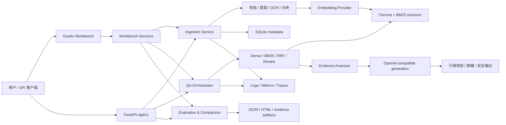
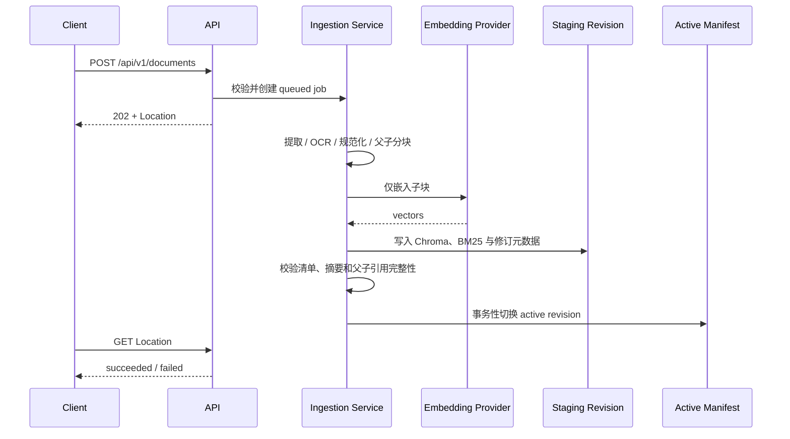

# 系统架构

本文描述 RAG Assistant MVP 的运行时边界、主要数据流和持久化方式。具体参数以 [`src/rag_mvp/config/settings.py`](../src/rag_mvp/config/settings.py) 与 [`.env.example`](../.env.example) 为准。

## 架构概览



应用是一个单进程 ASGI 服务。FastAPI 负责 API、生命周期和运行状态；Gradio 挂载到同一应用的 `/workbench`。服务启动时初始化数据目录、获取单写入锁、恢复未完成的摄取任务并启动评测运行时；关闭时在配置的宽限时间内完成资源清理。

## 主要模块

| 模块 | 职责 |
| --- | --- |
| `api` | 应用工厂、路由、错误契约、运行时装配和就绪检查 |
| `config` | 从环境变量和 dotenv 文件加载、校验配置，生成非敏感配置身份 |
| `ingestion` | 上传校验、PDF/文本提取、OCR、规范化、父子分块、嵌入和原子发布 |
| `retrieval` | 稠密检索、BM25、RRF 融合、可选重排、缓存和检索证据 |
| `qa` | 会话、查询改写、注入检查、证据评估、拒答、生成、引用和流式输出 |
| `evaluation` | 版本化数据集、执行计划、质量门禁、候选对比和不可变报告 |
| `safety` | 输入注入检测、输出及遥测脱敏、隐私制品扫描 |
| `observability` | 结构化日志、Prometheus 指标、OpenTelemetry 链路和成本记录 |
| `storage` | SQLite 仓储、制品路径约束、索引修订和写入锁 |
| `ui` | Chat、Documents、Evaluation 与 README 工作台页面 |

## 文档摄取与索引发布



支持 `.pdf`、`.md`、`.markdown` 和 `.txt`。文本必须是 UTF-8；PDF 不得加密或损坏，缺少可用原生文本的页面会按配置尝试 OCR。默认最大上传大小为 25 MiB。

摄取不会直接修改当前索引：每次上传、删除或重建都会生成新的修订，在稠密索引、BM25、父块和元数据全部校验成功后才原子发布。失败修订会被清理，原活动索引保持可用。

父子分块的默认关系如下：

- 父块约 1536 token，不跨越提取块，用于生成上下文。
- 子块约 512 token、重叠 128 token，用于嵌入、检索、重排、证据评估和引用。
- 生成前将获批子块扩展到对应父块，同时保留子块 ID 作为唯一引用身份。

详细约束见[父子分块与重建索引](parent-child-chunking.md)。

## 问答流程

问答请求由一个总截止时间约束，各阶段还有独立预算：

1. 校验 owner、会话、问题、语言、检索模式和缓存策略。
2. 检查用户输入中的提示词注入，并结合会话历史改写检索查询。
3. 执行稠密或混合检索；混合模式通过 RRF 融合稠密与 BM25 结果，`hybrid-rerank` 继续重排。
4. 对候选证据进行事实支持度评估；无结果、低置信度或不充分证据会触发拒答。
5. 将获批子块扩展为父块上下文，请求生成模型输出结构化答案。
6. 解析答案，校验每项声明的引用与活动索引修订，应用部分证据提示和敏感信息脱敏。
7. 以 `application/x-ndjson` 返回终态事件，并记录不包含原始敏感内容的诊断数据。

## 检索配置隔离

工作台可选择两种 profile：

| Profile | 嵌入 | 重排 | 答案生成 | 数据目录 |
| --- | --- | --- | --- | --- |
| `openai-api` | OpenAI-compatible | 可选 OpenAI-compatible | OpenAI-compatible | `RAG_MVP_DATA_ROOT` |
| `bge-local` | `BAAI/bge-m3` | `BAAI/bge-reranker-v2-m3` | OpenAI-compatible | `RAG_MVP_BGE_DATA_ROOT` |

每个 profile 拥有独立的文档目录、SQLite、摄取任务、会话、向量索引、BM25 快照和评测制品。HTTP 问答与文档 API 保持使用 `openai-api`；工作台可以切换 profile，评测/对比 API 可通过 `retrieval_profile=bge-local` 指定 BGE。

## 持久化布局

默认数据根目录是 `data/`，主要内容如下：

```text
data/
├── metadata.sqlite3          文档、任务、会话、父块和修订元数据
├── sources/                  版本化原始文档
├── canonical/                规范化文档制品
├── indexes/
│   ├── active.json           当前活动修订清单
│   └── revisions/<id>/
│       ├── chroma/           稠密向量索引
│       └── bm25.json         词法索引快照
├── caches/                   可选缓存
├── reports/                  报告
├── evaluations/              评测工作区和制品
├── jobs/                     持久化任务命令及临时上传
├── locks/writer.lock         单写入实例锁
└── tmp/                      受控临时目录
```

所有应用制品路径均被约束在数据根目录内，外部输入不能直接构造任意文件系统路径。Compose 分别持久化应用数据和 Hugging Face 模型缓存。

## 运行状态与安全边界

- `/healthz` 仅说明进程存活；依赖、索引或凭据不可用时仍可能返回 200。
- `/readyz` 汇总 configuration、provider、storage、QA、workbench 等组件；只有可以接受流量时返回 200，否则返回 503 和安全原因码。
- `/metrics` 暴露 Prometheus 文本指标；链路可关闭、打印到隐私安全控制台，或发送到显式配置的 OTLP HTTP 端点。
- 应用使用数据根目录写锁且 Uvicorn 固定为一个 worker。共享本地 SQLite/Chroma 数据目录的水平扩展不受支持。
- 项目负责 RAG 管道内的拒答、注入检查和脱敏，但不提供用户认证或租户级授权。公网部署必须由可信网关补齐身份和网络边界。
