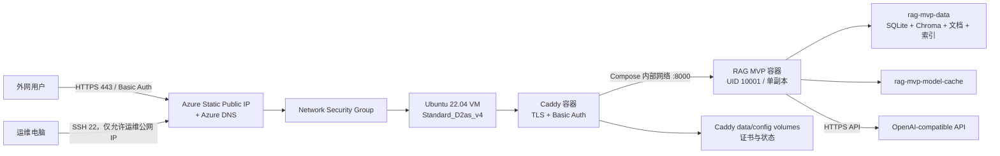

# RAG MVP Azure Global VM 部署技术文档

## 1. 文档目的

本文档说明如何将 RAG MVP 以 Docker Compose 方式部署到 Azure Global，并通过受保护的
HTTPS 地址提供外网访问。内容覆盖：

- 经过验证的参考部署资源与拓扑；
- 方案选择及约束；
- 全新部署、失败恢复和应用更新；
- Docker、Caddy、网络、存储和密钥设计；
- 健康检查、验收、日常运维、备份和回滚；
- 已知限制与常见故障排查。

本文档是可公开提交的部署模板，不代表当前存在在线资源，也不记录真实订阅 ID、租户 ID、
公网/私网 IP、DNS、Azure 资源 ID、SSH 私钥、Basic Auth 明文密码或 Provider API Key。
所有 `<...>` 均为必须在本地替换的占位符；替换后的环境交接信息不得提交到 Git。凭据只
保留在授权位置，并通过 SSH 按需读取。

## 2. 参考部署摘要

| 项目 | 参考值 |
|---|---|
| Azure 云 | Azure Global (`AzureCloud`) |
| Subscription ID | `<SUBSCRIPTION_ID>` |
| Tenant ID | `<TENANT_ID>` |
| 资源组 | `<RESOURCE_GROUP>` |
| 区域 | `southeastasia` |
| VM | `vm-rag-mvp` |
| VM 规格 | `Standard_D2as_v4`，2 vCPU / 8 GiB |
| OS | Ubuntu Server 22.04 LTS |
| OS 磁盘 | 128 GiB Premium SSD (`Premium_LRS`) |
| 公网 IP | `<PUBLIC_IP>`，Standard / Static |
| 私网 IP | `<PRIVATE_IP>` |
| DNS | `<PUBLIC_HOST>` |
| 公网入口 | `https://<PUBLIC_HOST>/workbench` |
| 镜像标签 | `rag-mvp:<SOURCE_REVISION>` |
| 应用副本 | 1 |
| Ingress | Caddy 2.10.2，自动 TLS + Basic Auth |
| 持久化 | VM 本地 Docker named volumes |

主要 Azure 资源：

- VM ID：`/subscriptions/<SUBSCRIPTION_ID>/resourceGroups/<RESOURCE_GROUP>/providers/Microsoft.Compute/virtualMachines/vm-rag-mvp`
- Public IP ID：`/subscriptions/<SUBSCRIPTION_ID>/resourceGroups/<RESOURCE_GROUP>/providers/Microsoft.Network/publicIPAddresses/pip-rag-mvp`
- NSG：`nsg-rag-mvp`
- VNet：`vnet-rag-mvp`
- NIC：`nic-rag-mvp`

## 3. 架构与请求链路



公网只开放 80、443 和受限来源的 22。应用的宿主机端口绑定为
`127.0.0.1:8000`，Azure NSG 中没有 8000 入站规则。因此外网不能绕过 Caddy 直接访问
FastAPI/Gradio 服务。

## 4. 为什么选择单台 Azure VM

应用当前依赖以下本地单写者语义：

- SQLite WAL；
- 本地 Chroma 与 BM25 索引；
- 本地上传文件和评估产物；
- 数据根目录的独占写锁；
- 单 Uvicorn worker 和单应用副本。

Azure Container Apps 最简单的持久化选项通常是 Azure Files，它属于网络文件系统，不适合
直接承载当前 SQLite WAL 设计。AKS + Azure Disk 可以保留块存储语义，但对单实例 MVP 来说
成本和复杂度过高。因此当前方案使用一台 VM 和本地 Docker named volume，以最小改造保持
应用语义。

该方案不是高可用架构：VM、OS 磁盘和 Docker daemon 都是单点。需要高可用时，应先将
SQLite、索引和文件存储迁移到支持多副本的外部服务，再评估 Container Apps 或 AKS。

## 5. Azure 网络与资源设计

### 5.1 资源隔离

所有部署资源位于独立资源组 `<RESOURCE_GROUP>`。部署脚本默认拒绝写入已存在的
资源组，避免误修改其他资源。只有在首次 VM 创建前已经生成了本部署的四个网络资源时，才
允许使用 `-ResumeProvisioning` 继续。

### 5.2 地址规划

| 网络项 | 配置 |
|---|---|
| VNet | `vnet-rag-mvp`，`10.42.0.0/16` |
| Subnet | `default`，`10.42.1.0/24` |
| NIC | `nic-rag-mvp` |
| VM 私网 IP | `<PRIVATE_IP>` |
| Public IP | `pip-rag-mvp`，Standard / Static |

### 5.3 NSG 入站规则

| 规则 | 端口 | 来源 | 用途 |
|---|---:|---|---|
| `AllowSshFromOperator` | TCP 22 | 部署时检测到的运维公网 IP `/32` | SSH 运维 |
| `AllowHttp` | TCP 80 | Internet | ACME HTTP 验证和 HTTPS 重定向 |
| `AllowHttps` | TCP 443 | Internet | 公网工作台 |

如果运维电脑公网 IP 变化，需要更新 SSH 规则，否则 SSH 会超时：

```powershell
$clientIp = (Invoke-RestMethod https://api.ipify.org).Trim()
az network nsg rule update `
  --resource-group '<RESOURCE_GROUP>' `
  --nsg-name nsg-rag-mvp `
  --name AllowSshFromOperator `
  --source-address-prefixes "$clientIp/32"
```

## 6. 容器拓扑

### 6.1 应用容器

应用服务由根目录 `compose.yaml` 定义，Azure override 位于
`deploy/azure-vm/compose.azure.yaml`。关键约束如下：

- 固定一个副本：`deploy.replicas: 1`；
- 进程用户：`10001:10001`；
- 根文件系统只读；
- 删除全部 Linux capabilities；
- 启用 `no-new-privileges`；
- PID 上限 512；
- 数据目录挂载 `rag-mvp-data`；
- 模型缓存挂载 `rag-mvp-model-cache`；
- 宿主机只监听 `127.0.0.1:8000`；
- Azure 首次部署关闭本地 BGE，使用 `openai-api` retrieval profile。

镜像构建还会显式复制两个运行时评估资源：

- `evaluations/privacy/supported-fixtures-v1.json`；
- `evaluations/pricing/openai-comparison-standard-2026-08-07-v1.json`。

`.dockerignore` 采用严格白名单，避免 `.env`、本地数据、结果目录、密钥、证书和 Git 元数据
进入构建上下文。

### 6.2 Caddy 容器

Caddy 负责：

- 使用 Azure DNS 主机名自动申请和续期 TLS 证书；
- 将 HTTP 重定向到 HTTPS；
- 在反向代理前执行 Basic Auth；
- 将认证后的流量代理到 Compose 内部的 `app:8000`；
- 将证书状态保存到 `rag-mvp-caddy-data` 和 `rag-mvp-caddy-config`。

Caddy 镜像通过 tag 和 digest 双重固定：

```text
caddy:2.10.2-alpine@sha256:4c6e91c6ed0e2fa03efd5b44747b625fec79bc9cd06ac5235a779726618e530d
```

### 6.3 健康与就绪

Azure override 使用 `/healthz` 作为 Docker 健康检查。原因是全新数据卷没有文档和索引时，
应用进程、上传能力和工作台已经可用，但 `/readyz` 会正确返回：

```json
{"status":"not_ready","components":[{"name":"qa","ready":false,"reason":"index_not_ready"}]}
```

此时 Caddy 仍应启动，让用户可以进入工作台上传第一份文档。首次摄取和索引成功后，QA
组件转为 ready。除 `index_not_ready` 之外的 readiness 失败会被验证脚本视为部署失败。

## 7. 持久化布局

| 名称 | 用途 | 删除影响 |
|---|---|---|
| `rag-mvp-data` | SQLite、Chroma、文档、索引和应用状态 | 丢失业务数据 |
| `rag-mvp-model-cache` | 模型和 Hugging Face 缓存 | 可重建，但会重新下载 |
| `rag-mvp-caddy-data` | TLS 证书和 Caddy 状态 | 重新申请证书 |
| `rag-mvp-caddy-config` | Caddy 运行配置状态 | 重新初始化 |

这些 named volumes 都位于 VM OS 管理磁盘。执行 `docker compose down` 不会删除它们；
执行 `docker compose down --volumes` 会删除业务数据，因此生产环境禁止使用 `--volumes`。

## 8. 密钥与凭据

### 8.1 SSH 私钥

本机私钥位置：

```text
%LOCALAPPDATA%\rag-mvp\azure-vm\<RESOURCE_GROUP>\id_ed25519
```

私钥不进入项目目录或部署归档。对应公钥安装到 VM 的 `<ADMIN_USER>` 账户。

### 8.2 Provider API Key

部署脚本只从本机 `.env` 读取 `RAG_MVP_OPENAI_API_KEY`，并通过 SSH 标准输入传输，不作为
Azure CLI 参数、镜像层、Compose 环境值或日志内容输出。

VM 保存位置：

```text
/opt/rag-mvp/secrets/provider-key
```

文件所有者为 `10001:10001`，权限为 `0400`。Compose 本地 secret 会忽略 YAML 中声明的
`uid/gid/mode`，所以权限必须在宿主机文件上设置；相关 warning 是已知行为。

### 8.3 Basic Auth

明文用户名和随机密码保存在：

```text
/opt/rag-mvp/secrets/basic-auth.txt
```

文件为 `root:root 0400`。Caddy runtime 配置只保存密码哈希，不保存明文密码。获取凭据：

```powershell
ssh -i "$env:LOCALAPPDATA\rag-mvp\azure-vm\<RESOURCE_GROUP>\id_ed25519" `
  '<ADMIN_USER>@<PUBLIC_HOST>' `
  "sudo cat /opt/rag-mvp/secrets/basic-auth.txt"
```

不要把命令输出粘贴到 issue、日志、文档或 Git。

## 9. 部署文件说明

| 文件 | 职责 |
|---|---|
| `Dockerfile` | 构建应用镜像并安装系统/OCR依赖 |
| `.dockerignore` | Docker 构建上下文白名单 |
| `compose.yaml` | 单实例应用、secret、卷和基础安全约束 |
| `deploy/azure-vm/Caddyfile` | Caddy 模板 |
| `deploy/azure-vm/compose.azure.yaml` | Azure 环境和 Caddy override |
| `deploy/azure-vm/deployment.env.example` | 无密钥的生产环境模板 |
| `deploy/azure-vm/bootstrap.sh` | 在 Ubuntu VM 安装 Docker |
| `deploy/azure-vm/configure.sh` | 生成 runtime 配置、认证密码和哈希 |
| `deploy/azure-vm/verify.sh` | 健康、认证、重启和持久化验收 |
| `deploy/azure-vm/deploy.ps1` | Azure 预检、创建、上传、构建和验证编排 |
| `deploy/azure-vm/README.md` | 可公开提交的部署脚本与操作速查 |

## 10. 前置条件

本机需要：

- Azure CLI，目标云为 `AzureCloud`；
- 已执行 `az login`，订阅状态为 Enabled；
- PowerShell；
- `ssh`、`scp`、`ssh-keygen` 和 `tar`；
- Git；
- 项目根目录 `.env` 中存在非空 `RAG_MVP_OPENAI_API_KEY`；
- Azure 订阅对目标区域和 VM family 有足够 vCPU quota；
- 本机公网 IP 能被正确检测，以生成 SSH `/32` 规则。

检查当前账号：

```powershell
az cloud show --query name -o tsv
az account show --query "{subscription:id,state:state,tenant:tenantId}" -o json
```

检查区域配额和 VM SKU：

```powershell
az vm list-usage --location southeastasia -o table
az vm list-skus --location southeastasia --resource-type virtualMachines -o table
```

如果目标订阅在 Southeast Asia 的 DSv5 family quota 为 0，应选择配额可用的其他规格，
例如参考配置使用的 `Standard_D2as_v4`；不要在同一不可用 family 上反复创建。

## 11. 全新部署

### 11.1 登录并确认订阅

```powershell
az cloud set --name AzureCloud
az login
az account show -o table
```

如果账号中有多个订阅，显式选择：

```powershell
az account set --subscription '<SUBSCRIPTION_ID>'
```

### 11.2 确认本地 secret

`.env` 只需要包含 provider key。不要把文件提交到 Git：

```dotenv
RAG_MVP_OPENAI_API_KEY=replace-with-real-key
```

### 11.3 执行部署脚本

从项目根目录运行：

```powershell
& .\deploy\azure-vm\deploy.ps1 `
  -ResourceGroup '<RESOURCE_GROUP>' `
  -Location 'southeastasia' `
  -VmName 'vm-rag-mvp' `
  -VmSize 'Standard_D2as_v4' `
  -AdminUser '<ADMIN_USER>' `
  -DnsLabel '<DNS_LABEL>' `
  -ProviderEnvFile '.env'
```

脚本按顺序执行：

1. 读取 Git revision、Azure cloud、订阅、SKU、provider key 和本地工具；
2. 确认资源组名尚未存在；
3. 注册 Compute 和 Network resource providers；
4. 创建资源组、静态 Public IP、DNS label、NSG、VNet、Subnet 和 NIC；
5. 创建 Ubuntu VM 和 128 GiB Premium OS disk；
6. 验证 SSH；
7. 创建严格白名单源码归档并上传；
8. 安装 Docker Engine、Buildx 和 Compose plugin；
9. 通过 SSH stdin 写入 provider key；
10. 生成 Basic Auth 密码、Caddy runtime 配置和 `deployment.env`；
11. 在 VM 构建 revision-tagged 镜像并启动 Compose；
12. 验证应用健康、空索引状态、HTTPS 认证、重启和持久卷。

每个可重试的阻塞操作最多尝试两次。第二次仍失败时脚本停止，保留资源用于诊断，不自动
删除资源组。

## 12. 首次 VM 创建失败后的恢复

`-ResumeProvisioning` 只用于以下严格场景：

- 本次部署已经创建资源组；
- 资源组内只有 `pip-rag-mvp`、`nsg-rag-mvp`、`vnet-rag-mvp` 和
  `nic-rag-mvp` 四个网络资源；
- VM 尚未创建；
- 本机仍保留该资源组对应的 SSH key。

示例：

```powershell
& .\deploy\azure-vm\deploy.ps1 `
  -ResourceGroup '<RESOURCE_GROUP>' `
  -Location 'southeastasia' `
  -VmName 'vm-rag-mvp' `
  -VmSize 'Standard_D2as_v4' `
  -AdminUser '<ADMIN_USER>' `
  -DnsLabel '<DNS_LABEL>' `
  -ProviderEnvFile '.env' `
  -ResumeProvisioning
```

VM 已经存在时不要使用此参数。此时应走“应用更新”流程，而不是重新执行基础设施创建。

## 13. 应用更新

部署脚本主要面向全新资源组，不应直接对现有生产资源组重复运行。更新应用时保持资源、
secret 和 named volumes 不变，只同步严格白名单源码并重新构建。

### 13.1 本机构建更新归档

```powershell
$revision = (git rev-parse HEAD).Trim()
$archive = Join-Path $env:TEMP "rag-mvp-$revision.tgz"

tar -czf $archive `
  .dockerignore Dockerfile compose.yaml pyproject.toml uv.lock src `
  deploy/azure-vm `
  evaluations/privacy/supported-fixtures-v1.json `
  evaluations/pricing/openai-comparison-standard-2026-08-07-v1.json
```

### 13.2 上传并解压

```powershell
$key = "$env:LOCALAPPDATA\rag-mvp\azure-vm\<RESOURCE_GROUP>\id_ed25519"
$hostName = '<PUBLIC_HOST>'

scp -i $key $archive "<ADMIN_USER>@${hostName}:/tmp/rag-mvp-update.tgz"
ssh -i $key "<ADMIN_USER>@$hostName" `
  "sudo tar -xzf /tmp/rag-mvp-update.tgz -C /opt/rag-mvp/app && sudo chown -R <ADMIN_USER>:<ADMIN_USER> /opt/rag-mvp/app"
```

### 13.3 重新生成非 secret runtime 配置

```powershell
ssh -i $key "<ADMIN_USER>@$hostName" `
  "sudo bash /opt/rag-mvp/app/deploy/azure-vm/configure.sh $hostName $revision && sudo chown -R <ADMIN_USER>:<ADMIN_USER> /opt/rag-mvp/app"
```

### 13.4 构建、启动和验证

登录 VM 后执行：

```bash
cd /opt/rag-mvp/app
compose=(docker compose --env-file deployment.env \
  -f compose.yaml -f deploy/azure-vm/compose.azure.yaml)

"${compose[@]}" build app
"${compose[@]}" up -d
sudo bash deploy/azure-vm/verify.sh \
  '<PUBLIC_HOST>'
```

先确认新版本健康，再删除旧镜像。不要使用 `docker system prune --volumes`。

## 14. 验收与验证

运行完整验证：

```bash
sudo bash /opt/rag-mvp/app/deploy/azure-vm/verify.sh \
  '<PUBLIC_HOST>'
```

脚本验证：

1. `http://127.0.0.1:8000/healthz` 返回成功；
2. `/readyz` 为 200，或空知识库仅报告 `index_not_ready`；
3. 匿名 HTTPS 请求返回 401；
4. 使用 VM 保存的 Basic Auth 凭据可以访问 workbench；
5. Compose 配置包含应用数据卷；
6. `rag-mvp-data` 实际存在；
7. 重启应用容器后健康检查恢复；
8. `metadata.sqlite3` 在持久卷中仍存在且非空。

手工检查：

```bash
curl -fsS http://127.0.0.1:8000/healthz
curl -sS http://127.0.0.1:8000/readyz
docker compose --env-file /opt/rag-mvp/app/deployment.env \
  -f /opt/rag-mvp/app/compose.yaml \
  -f /opt/rag-mvp/app/deploy/azure-vm/compose.azure.yaml ps
```

外网匿名保护检查：

```powershell
curl.exe -sS -o NUL -w "%{http_code}" `
  'https://<PUBLIC_HOST>/workbench'
```

预期为 `401`。

## 15. 日常运维

### 15.1 SSH 登录

```powershell
ssh -i "$env:LOCALAPPDATA\rag-mvp\azure-vm\<RESOURCE_GROUP>\id_ed25519" `
  '<ADMIN_USER>@<PUBLIC_HOST>'
```

### 15.2 Compose 命令

```bash
cd /opt/rag-mvp/app
compose=(docker compose --env-file deployment.env \
  -f compose.yaml -f deploy/azure-vm/compose.azure.yaml)

"${compose[@]}" ps
"${compose[@]}" up -d
"${compose[@]}" restart app
"${compose[@]}" restart caddy
"${compose[@]}" down
```

`down` 默认保留卷；不要增加 `--volumes`。

### 15.3 日志

```bash
docker logs --tail 200 rag-mvp
docker logs --tail 200 rag-mvp-caddy-1
docker logs --since 30m rag-mvp
```

日志不得包含 provider key 或 Basic Auth 明文。如果需要共享日志，应先检查并脱敏。

### 15.4 资源与磁盘检查

```bash
df -h
docker system df
docker volume ls
docker inspect rag-mvp --format '{{json .State.Health}}'
```

避免无计划清理 Docker volumes。镜像和 build cache 可以在确认当前镜像可恢复后单独清理。

### 15.5 Azure VM 状态

```powershell
az vm get-instance-view `
  --resource-group '<RESOURCE_GROUP>' `
  --name vm-rag-mvp `
  --query "instanceView.statuses[].displayStatus" -o tsv
```

## 16. 凭据轮换

### 16.1 Basic Auth 密码轮换

在 VM 上生成新密码并重新生成 Caddy 配置：

```bash
sudo bash -c '
set -euo pipefail
umask 077
password="$(openssl rand -base64 32 | tr -d "\r\n=/+")"
printf "ragadmin:%s\n" "$password" > /opt/rag-mvp/secrets/basic-auth.txt
chmod 0400 /opt/rag-mvp/secrets/basic-auth.txt
'

revision="$(grep '^RAG_MVP_SOURCE_REVISION=' /opt/rag-mvp/app/deployment.env | cut -d= -f2-)"
sudo bash /opt/rag-mvp/app/deploy/azure-vm/configure.sh \
  '<PUBLIC_HOST>' "$revision"
cd /opt/rag-mvp/app
docker compose --env-file deployment.env \
  -f compose.yaml -f deploy/azure-vm/compose.azure.yaml \
  up -d --force-recreate caddy
```

轮换后通过第 8.3 节命令获取新密码。旧密码立即失效。

### 16.2 Provider API Key 轮换

不要把新 key 作为 SSH 命令行参数。应通过标准输入写入，随后恢复 owner/mode 并重建应用
容器。示例 PowerShell：

```powershell
$keyPath = "$env:LOCALAPPDATA\rag-mvp\azure-vm\<RESOURCE_GROUP>\id_ed25519"
$hostName = '<PUBLIC_HOST>'
$secureProviderKey = Read-Host 'New provider key' -AsSecureString
$secretPointer = [Runtime.InteropServices.Marshal]::SecureStringToBSTR($secureProviderKey)
try {
  $providerKey = [Runtime.InteropServices.Marshal]::PtrToStringBSTR($secretPointer)
  $providerKey | ssh -i $keyPath "<ADMIN_USER>@$hostName" `
    "sudo tee /opt/rag-mvp/secrets/provider-key >/dev/null && sudo chown 10001:10001 /opt/rag-mvp/secrets/provider-key && sudo chmod 0400 /opt/rag-mvp/secrets/provider-key"
} finally {
  $providerKey = $null
  [Runtime.InteropServices.Marshal]::ZeroFreeBSTR($secretPointer)
}
```

然后在 VM 上执行：

```bash
cd /opt/rag-mvp/app
docker compose --env-file deployment.env \
  -f compose.yaml -f deploy/azure-vm/compose.azure.yaml \
  up -d --force-recreate app caddy
```

## 17. 备份与恢复

### 17.1 应用一致性要求

SQLite 使用 WAL，Chroma 和文件索引也可能同时更新。备份前应停止 Compose 项目，避免得到
彼此不一致的文件集合：

```bash
cd /opt/rag-mvp/app
docker compose --env-file deployment.env \
  -f compose.yaml -f deploy/azure-vm/compose.azure.yaml down
```

备份完成后重新启动：

```bash
docker compose --env-file deployment.env \
  -f compose.yaml -f deploy/azure-vm/compose.azure.yaml up -d
```

### 17.2 Azure OS Disk snapshot

停止应用后，在运维电脑执行：

```powershell
$osDiskId = az vm show `
  --resource-group '<RESOURCE_GROUP>' `
  --name vm-rag-mvp `
  --query storageProfile.osDisk.managedDisk.id -o tsv

az snapshot create `
  --resource-group '<RESOURCE_GROUP>' `
  --name "snap-rag-mvp-$(Get-Date -Format yyyyMMdd-HHmm)" `
  --source $osDiskId `
  --location southeastasia
```

Snapshot 会额外产生费用。参考方案默认没有自动备份策略。

### 17.3 Named volume 文件归档

也可以停止应用后，把数据卷归档到 VM 临时备份目录，再使用 `scp` 复制到外部存储。归档仍
位于同一 OS 磁盘时不构成独立灾备，必须复制出 VM。

```bash
sudo install -d -m 0700 /opt/rag-mvp/backups
sudo docker run --rm \
  --mount type=volume,src=rag-mvp-data,dst=/source,readonly \
  --mount type=bind,src=/opt/rag-mvp/backups,dst=/backup \
  alpine:3.22 tar -czf /backup/rag-mvp-data.tgz -C /source .
```

恢复前应停止应用，恢复到空的新卷或经过明确确认的目标卷，避免覆盖现有数据。

## 18. 回滚与资源删除

### 18.1 应用级回滚

保留旧 revision 镜像时，可以把 `deployment.env` 中的 `RAG_MVP_IMAGE` 改回旧 tag，然后：

```bash
cd /opt/rag-mvp/app
docker compose --env-file deployment.env \
  -f compose.yaml -f deploy/azure-vm/compose.azure.yaml up -d
```

回滚前后都应运行验证脚本。数据库 schema 若发生不可逆迁移，应使用兼容的备份恢复方案，
不能只切换镜像。

### 18.2 停止服务但保留数据

```bash
cd /opt/rag-mvp/app
docker compose --env-file deployment.env \
  -f compose.yaml -f deploy/azure-vm/compose.azure.yaml down
```

### 18.3 删除全部 Azure 资源

以下操作会删除 VM、OS 磁盘、Public IP、网络和所有 Docker volume 数据。仅在已完成备份且
明确需要永久删除时执行：

```powershell
az group delete --name '<RESOURCE_GROUP>' --yes --no-wait
```

删除后无法通过本地 SSH 私钥恢复 OS 磁盘数据。

## 19. 常见故障排查

### 19.1 VM family quota 为 0

现象：`QuotaExceeded`，例如 `standardDSv5Family Cores quota` 为 0。

处理：

1. 查询区域 family quota；
2. 选择同等规格且配额可用的 VM family，例如参考配置使用的 `Standard_D2as_v4`；
3. 或在 Azure Portal 申请 quota increase；
4. 不要在同一不可用 family 上重复创建。

### 19.2 Azure CLI 提示 NoNetwork 或需要重新登录

```powershell
az account show
az login --tenant '<TENANT_ID>'
```

重新登录后先做只读查询，不要直接重新运行资源创建脚本。

### 19.3 SSH 超时

检查：

- VM power state 是否为 running；
- DNS 是否解析到 `<PUBLIC_IP>`；
- 当前公网 IP 是否仍匹配 NSG 的 `/32`；
- 私钥路径是否正确；
- `known_hosts` 是否位于同一部署目录。

### 19.4 `provider_credentials_missing`

检查 metadata，不要输出文件内容：

```bash
sudo stat -c '%n uid=%u gid=%g mode=%a size=%s' \
  /opt/rag-mvp/secrets/provider-key
docker exec rag-mvp test -r /run/secrets/openai_api_key
```

预期 owner/group 为 `10001:10001`、mode 为 `400`，且容器内可读。

### 19.5 `privacy fixture file is unavailable`

确认 Dockerfile、部署归档和 `.dockerignore` 都包含：

```text
evaluations/privacy/supported-fixtures-v1.json
```

### 19.6 `comparison-pricing-unavailable`

确认以下文件已进入构建上下文和镜像：

```text
evaluations/pricing/openai-comparison-standard-2026-08-07-v1.json
```

### 19.7 空知识库显示 `index_not_ready`

这是预期状态，不表示进程故障。检查 `/healthz` 应为 200，工作台应可访问。上传第一份有效
文档并等待 ingestion 完成后再次检查 `/readyz`。

### 19.8 Caddy 无法签发证书

检查：

```bash
docker logs --tail 200 rag-mvp-caddy-1
```

同时确认：

- DNS FQDN 指向当前静态 Public IP；
- NSG 允许 Internet 到 TCP 80 和 443；
- VM 本地没有其他服务占用 80/443；
- Caddy data volume 可写；
- 没有触发 ACME rate limit。

### 19.9 外网返回 401

这是未提供 Basic Auth 时的正确行为。浏览器应弹出认证窗口。若认证后仍为 401，重新读取
VM 上的凭据，确认没有复制额外空格或换行。

### 19.10 应用容器 unhealthy

```bash
docker inspect rag-mvp --format '{{json .State.Health}}'
docker logs --tail 200 rag-mvp
curl -sS http://127.0.0.1:8000/healthz
curl -sS http://127.0.0.1:8000/readyz
```

诊断时不得输出 provider key。相同阻塞操作最多尝试两次，第二次仍失败后应停止并保留
现场。

## 20. 安全基线与后续改进

当前已实现：

- HTTPS 自动证书；
- Basic Auth 访问门；
- SSH 来源 IP 限制；
- 应用端口仅 loopback；
- 单副本和非 root 容器用户；
- 只读根文件系统、capability drop 和 no-new-privileges；
- provider key 不进入镜像、Git 和 Azure CLI 参数；
- 镜像基础层和 Caddy 使用 digest 固定；
- 独立资源组和有界重试。

生产化建议按优先级考虑：

1. 将 Basic Auth 替换为应用账号体系或 Microsoft Entra ID/OIDC；
2. 将 provider key 迁移到 Azure Key Vault 和 Managed Identity；
3. 配置 Azure Backup 或定时 application-consistent snapshot；
4. 配置磁盘、CPU、内存、HTTP 失败率和证书告警；
5. 启用自动安全更新并制定维护窗口；
6. 将镜像构建迁移到 CI/CD 和 ACR，使用不可变 digest 部署；
7. 增加 staging 环境和正式回滚演练；
8. 在多用户或高可用需求出现前迁移 SQLite/Chroma/本地文件存储。

## 21. 费用与容量注意事项

以下为 **2026-08-09** 通过 Azure Retail Prices API 查询的公开按量付费估算。口径为
Azure Global、Southeast Asia、Linux、每月 730 小时、P10 Premium SSD 和一个 Standard
静态 IPv4：

| 方案 | VM 公开价 | VM/月 | 磁盘/月 | 公网 IP/月 | 基础设施合计/月 |
|---|---:|---:|---:|---:|---:|
| CPU：`Standard_D2as_v4`（2 vCPU / 8 GiB） | `$0.120/小时` | `$87.60` | `$19.71` | `$3.65` | **约 `$110.96`** |
| GPU：`Standard_NC4as_T4_v3`（4 vCPU / 28 GiB / 1×T4 16 GB） | `$0.736/小时` | `$537.28` | `$19.71` | `$3.65` | **约 `$560.64`** |

GPU 方案适合作为本地 BGE/CUDA 推理的容量参考，但需要额外配置 NVIDIA 驱动、Container
Toolkit、CUDA 镜像/依赖和 `bge-local`，并确认区域供应与 GPU quota。以上均为未折扣美元
零售价，不含税费、出站流量、snapshot/backup 和 OpenAI-compatible API 调用。价格可通过
[Azure Retail Prices API](https://learn.microsoft.com/en-us/rest/api/cost-management/retail-prices/azure-retail-prices)
复查，GPU 硬件规格见
[Azure NCasT4_v3 规格](https://learn.microsoft.com/en-us/azure/virtual-machines/sizes/gpu-accelerated/ncast4v3-series)。

持续费用主要来自：

- `Standard_D2as_v4` VM 运行时长；
- 128 GiB Premium SSD OS disk；
- Standard Public IP；
- 出站网络流量；
- OpenAI-compatible API 调用；
- 未来创建的 snapshot 或 backup。

停止应用容器不会停止 VM 计费。`az vm deallocate` 可以停止 compute 计费，但 OS disk、
Public IP 和 snapshot 等资源仍计费。重新启动 VM 后 Docker 服务和 `restart: unless-stopped`
容器应恢复，但仍需运行完整验证。

## 22. 交接检查清单

- [x] Azure Global 资源位于独立资源组；
- [x] VM 使用配额可用的 2 vCPU / 8 GiB 规格；
- [x] SSH 仅允许部署者公网 IP；
- [x] 80/443 对外开放，8000 不对外开放；
- [x] Caddy 自动 HTTPS 和 Basic Auth 正常；
- [x] 匿名访问返回 401；
- [x] 认证访问成功；
- [x] provider key 不在镜像和仓库中；
- [x] 应用容器单副本、非 root、只读根文件系统；
- [x] 应用重启后持久卷数据存在；
- [x] 空知识库状态被明确记录；
- [x] 运维、备份、回滚和删除流程已记录；
- [ ] 配置自动备份与恢复演练；
- [ ] 用 Entra ID/OIDC 替换 Basic Auth；
- [ ] 配置正式监控、告警与 CI/CD。
